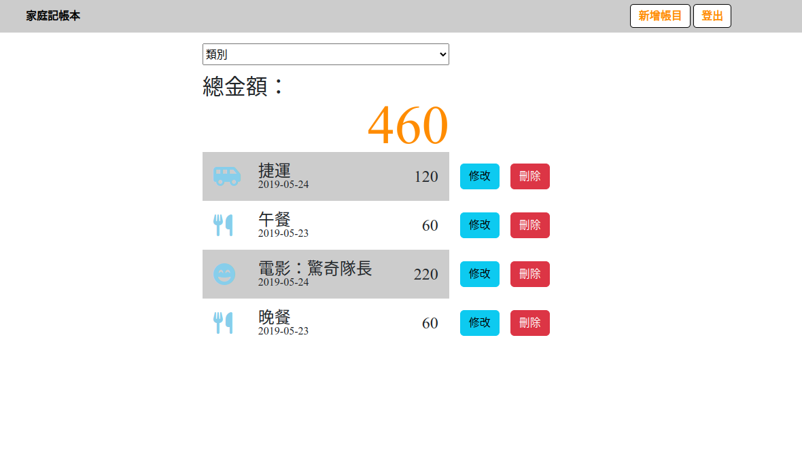

# expense-tracker
可以用來記帳的一個簡易網站

## 功能
- 可創建自己的帳戶
- 顯示當下使用者的所有帳目
- 可以依照類別搜尋帳目
- 可以增加、刪除、修改帳目
## 使用
1. 複製專案
```
git clone https://github.com/kany102030/expense-tracker.git
```
2. 安裝 node.js 與 npm
- https://nodejs.org/
- https://www.npmjs.com/
3. 為方便測試註冊，MongoDB Atlas
- https://www.mongodb.com/it-it/cloud/atlas/register
4. 於專案資料夾開啟終端機輸入以下指令安裝相依套件
```
npm install
```
5. 於專案路徑下創建.env，設定相關參數（可參考.env.example）
6. 執行seed
```
npm run seed
```
執行後會於資料庫增加
* 使用者1：
name: 廣志
email: user1@user1.com
password: 1234

* 使用者2：
name: 小新
email: user2@user2.com
password: 1234

7. 執行專案
```
npm run start
```
8. 成功會顯示以下
```
listening on http://localhost:<PORT>
```

9. 打開瀏覽器輸入http://localhost:3000/


## 開發套件版本
- Node.js: 16.16.0
- Express: 4.18.1
- Express-handlebars: 6.0.6
- Bootstrap: 5.2.0
- mongoose: 6.5.4
